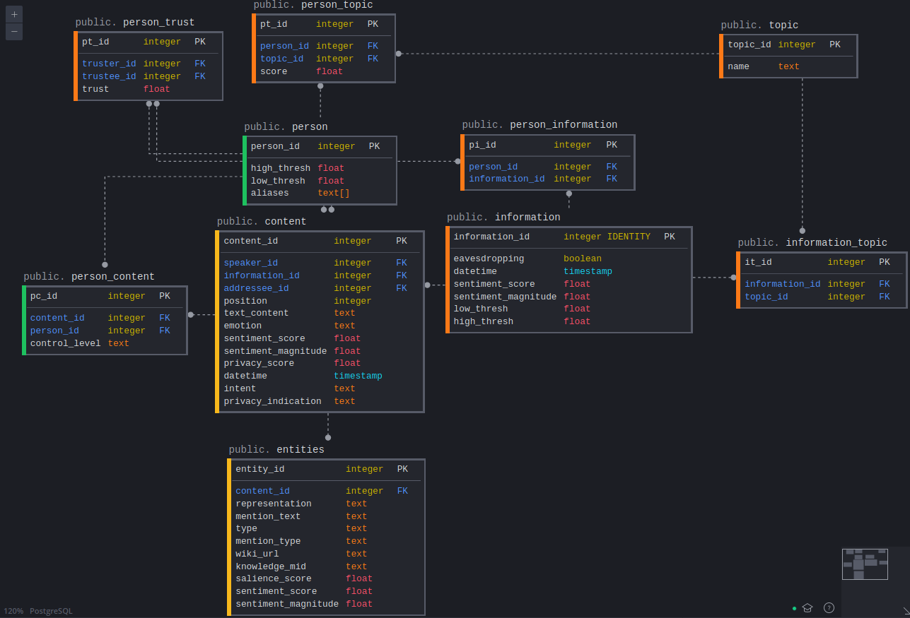

# HRI Privacy

## Setup
```
sudo apt update
sudo apt install postgresql postgresql-contrib
conda create --name env OR python3 -m venv env
conda activate env OR source env/bin/activate
pip install -e .
pip install -r requirements.txt
sudo nano /etc/postgresql/12/main/postgresql.conf        # Change listen_addresses to *
```

## Development
### Populating Database With Conversations
- Add conversation samples to `data` and `data/metadata`.
- Copy and paste the existing conversation examples `data/conversation1/` and `data/metadata/conversation1.py`.
- Follow the structure of the existing examples.
- Add a new person to `data/metadata/people.py`
- Change the `CONVERSATION` constant in `run/populate_db.py` to the correct number.
- `python run/populate_db.py`

### Testing Rule Enforcement
- Add rules, constraints, and assumptions to `src/rules.py`.
- Edit `src/test.py` constants to specific content_id and person_id pairs or uncomment `test_loop()` to loop through all content_id and person_id pairs.
- `python run/test.py`

### Testing Trust Updater
- `python run/test.py`

### Database Interface

- Check `src/database.py` and `src/db_wrapper.py` for more information.

### Google API
- [https://cloud.google.com/natural-language/docs/basics]
- [https://googleapis.dev/python/language/latest/language_v1/types.html]
- View `src/natural_language.py` for existing implementations.

## GitHub
### Flow
- `git pull`
- `git checkout -b myname/branch_name` OR `git checkout myname/branch_name --track`
- Make your changes on this branch.
- `git add file_name`
- `git commit -m "Commit message"`
- `git push origin myname/branch_name`
- Make a pull request for master_branch <-- working_branch.
- Name the pull request title like a commit message.
- Add your comments or relevant files.
- Request a review from someone on the "Reviewers" tab to the right.
- (They add their comments and/or approve the request)
- Add and commit your new changes to the branch.
- Re-request a review if necessary.
- "Squash and merge" the pull request.

### Branches
- `git branch` : Check your current working branch.
- `git checkout branch_name` : Switches to a branch already created locally.
- `git checkout branch_name --track` : Switches to a branch already created non-locally.
- `git checkout -b branch_name` : Creates and switches to a new branch created locally.
- Name the branch along the lines of: brian/add_trust_rule.

### Pull Requests
- Choose the base as master (typically) and the compare as the branch you committed your changes to.
- Title the pull request as if it were a commit.

### Code Reviews
- Look for conflicts or issues and add comments.

### Merging
- Choose "Squash and merge" in the dropdown.
